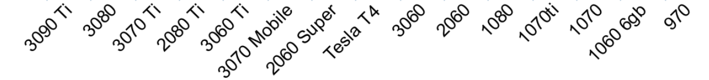
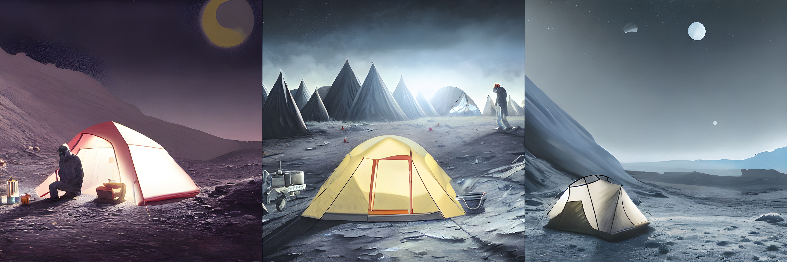

# Stable-Diffusion-Guide
  
This is a guide for installing and using **Stable Diffusion GRisk GUI** & **chaiNNer** on Windows with an NVIDIA gpu. It's easy to use once you set it up, but you need to download a few things.  
  
<!-- TOC -->
* [Stable-Diffusion-Guide](#stable-diffusion-guide)
  * [0. Pre-reqs](#0-pre-reqs)
  * [1. Downloads](#1-downloads)
  * [2. Nvidia Downloads](#2-nvidia-downloads)
  * [3. CLI Downloads](#3-cli-downloads)
  * [4. Installs](#4-installs)
  * [5. Generating images](#5-generating-images)
  * [6. Up-scaling](#6-up-scaling)
  * [7 Useful Resources](#7-useful-resources)
<!-- TOC -->
  
## 0. Pre-reqs
- An NVIDIA GPU with at least 4gb of VRAM  

  
## 1. Downloads
[Python 3.10](https://www.microsoft.com/store/productId/9PJPW5LDXLZ5)  
[GRisk GUI](https://grisk.itch.io/stable-diffusion-gui (red download button, scroll down))  
[chaiNNer](https://github.com/joeyballentine/chaiNNer/releases (download the Windows exe from the Assets section of the latest release))  
[upscale dir.chn](https://drive.google.com/file/d/13H7pYNdbiec_WNA066GZww0aD_Ncehh6/view?usp=sharing)  
[upscale file.chn](https://drive.google.com/file/d/11E448sFli2zUgPAHSIHmxc7EzxIRQL3A/view?usp=sharing)  
[RealESRGAN_x4plus.pth](https://github.com/xinntao/Real-ESRGAN/releases/download/v0.1.0/RealESRGAN_x4plus.pth)  
[RealESRGAN_x4plus_anime_6B.pth](https://github.com/xinntao/Real-ESRGAN/releases/download/v0.2.2.4/RealESRGAN_x4plus_anime_6B.pth)  
  
## 2. Nvidia Downloads
[cuDDN](https://developer.nvidia.com/compute/cudnn/secure/8.5.0/local_installers/11.7/cudnn-windows-x86_64-8.5.0.96_cuda11-archive.zip)

## 3. CLI Downloads
Open windows command prompt, paste this in, and hit enter.  
`pip3 install torch torchvision torchaudio --extra-index-url https://download.pytorch.org/whl/cu116`
  
## 4. Installs
Run the *chaiNNer* and *cuDNN* installers, then you can delete them. Move/Unzip the remaining files, so it's something like  
```
[AI]
|--
|--RealESRGAN_x4plus.pth
|--RealESRGAN_x4plus_anime_6B.pth
|--upscale dir.chn
|--upscale file.chn
|--
|--[GRisk Gui] (unzipped)
|--|
|--|--Stable Diffusion GRisk GUI.exe (<--- this is what you run)
```
  
## 5. Generating images
Launch *Stable Diffusion GRisk GUI.exe*. A command line will open and a UI should pop up. You can ignore the command line warnings at startup. The command line will show you the generation progress. Change the following:  
- `Output folder` - this is where you generated images get output  
- `Steps` - set to **100**  
- `Resolution` - try **512** x **512** first. If that fails, use **256** x **256**   
  
  
- `Text Inputs` - this is where you put your prompts. You get 1 image for each line. You can repeat lines to get multiple images. Generally more detail is good. For example, I used this prompt for the camping images:  
  
  
> A Coleman Sundome Camping Tent lit from inside, on the surface of the moon, cinematic lighting, highly detailed, sharp focus, digital painting, art by junji ito and WLOP, professional photoshoot  
  
After entering your prompts, hit render. It can't be paused, but you can close the gui to stop it. When it's done, you'll see **Done** in the command line and the image(s) will be output. The speed will depend on your gpu. For 100 steps, mine takes ~30 seconds / image.
  
## 6. Up-scaling
Once you have some images you like, you can upscale them with chaiNNer. Open chaiNNer like a normal app. Then, in the top left, click **File** > **Open**. Find `upscale dir.chn` or `upscale file.chn` that you downloaded earlier. The **file** one is for up-scaling a single file, the **dir** one is for up-scaling everything in a directory.  
For the **file** one, you can click on the **Load Image** node and select an input file (or you can just drag and drop a photo on it).  
For the **dir** one, you select the directory at the top of the **Image File Iterator** node.  
The default nodes should be fine, but you can mess with them, it's pretty intuitive. If you're up-scaling "anime" or similar art style, change the model in the upscale node to the `RealESRGAN_x4plus_anime_6B.pth`.  
  
To run, hit start at the top.
  
Scaled photos will show up in a `[Scaled]` directory inside the input folder (you can change this on the output node).  
  
## 7 Useful Resources
[StableDiffusion wiki (prompt tips)](https://wiki.installgentoo.com/wiki/Stable_Diffusion)  
[Prompt builder](https://promptomania.com/stable-diffusion-prompt-builder/)  